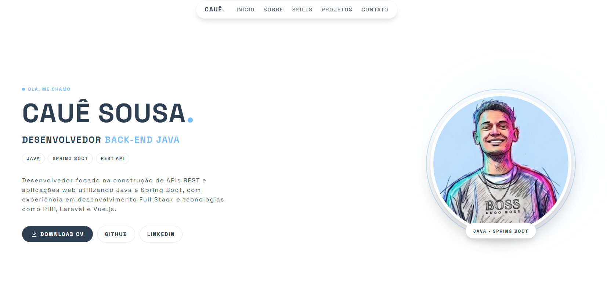

# 🚀 Portfólio — Cauê Sousa



Portfólio pessoal desenvolvido para apresentar minha trajetória como desenvolvedor, minhas principais tecnologias, projetos e experiências no desenvolvimento de aplicações web.

🔗 **Portfólio:** [Acesse o projeto](https://caueptfo.netlify.app)

---

## 👨‍💻 Sobre o projeto

Este projeto foi desenvolvido para centralizar minha apresentação profissional e demonstrar, na prática, meus conhecimentos em desenvolvimento Front-end e Back-end.

O portfólio apresenta:

* 👤 Sobre mim
* 🛠️ Principais tecnologias
* 🚀 Projetos desenvolvidos
* 💡 Diferenciais profissionais
* 📬 Formas de contato
* 🔗 Links para GitHub e LinkedIn

---

## 🛠️ Tecnologias utilizadas

### Front-end


### Back-end


### Banco de dados


### Ferramentas


---

## ✨ Destaques

* Design responsivo para desktop e dispositivos móveis
* Interface minimalista e moderna
* Navegação por seções
* Menu mobile
* Carrossel de projetos
* Links para projetos e redes profissionais
* Seção de tecnologias
* CTA para contato
* Foco em experiência de usuário e organização visual

---

## 📂 Estrutura do projeto

```text
src/
├── assets/
│   ├── img/
│   └── ...
│
├── components/
│   ├── TheHeader.vue
│   ├── AboutMe.vue
│   ├── MySkills.vue
│   ├── MyProjects.vue
│   ├── WhyChooseMe.vue
│   ├── TheContact.vue
│   └── TheFooter.vue
│
├── App.vue
└── main.js
```

---

## 🚀 Como executar o projeto

### 1. Clone o repositório

```bash
git clone https://github.com/w-Caue/portfolio.git
```

### 2. Acesse a pasta

```bash
cd portfolio
```

### 3. Instale as dependências

```bash
npm install
```

### 4. Execute o projeto

```bash
npm run dev
```

O projeto estará disponível no endereço indicado pelo Vite no terminal.

---

## 📦 Build para produção

Para gerar a versão de produção:

```bash
npm run build
```

---

## 🎯 Objetivo profissional

Atualmente direciono meus estudos e projetos para o desenvolvimento **Back-end com Java e Spring Boot**, com foco em:

* APIs REST
* Spring Security
* JPA / Hibernate
* MySQL
* Arquitetura em camadas
* Programação Orientada a Objetos
* Boas práticas de desenvolvimento

Também possuo experiência com **PHP, Laravel, JavaScript, Vue.js e Livewire**, proporcionando uma visão Full Stack do desenvolvimento de aplicações.

---

## 📬 Contato

**Cauê Sousa**

💼 [LinkedIn](https://www.linkedin.com/in/cauesousadev/)

💻 [GitHub](https://github.com/w-Caue)

🌐 [Portfólio](https://caueptfo.netlify.app)

---

⭐ Se este projeto foi útil ou interessante para você, considere deixar uma estrela no repositório.
